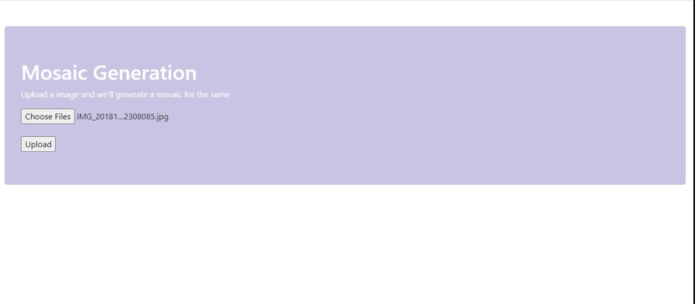
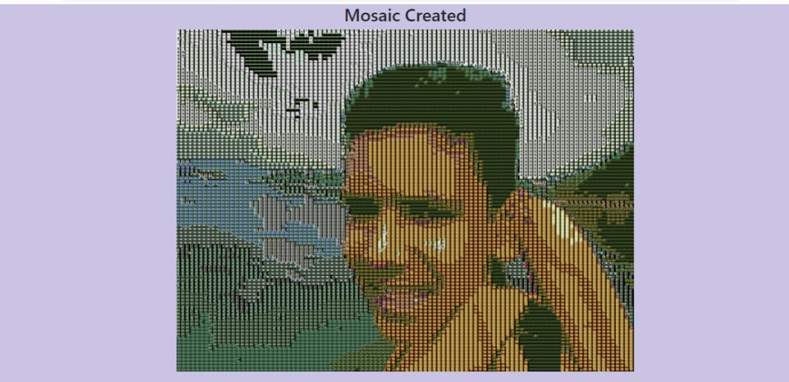
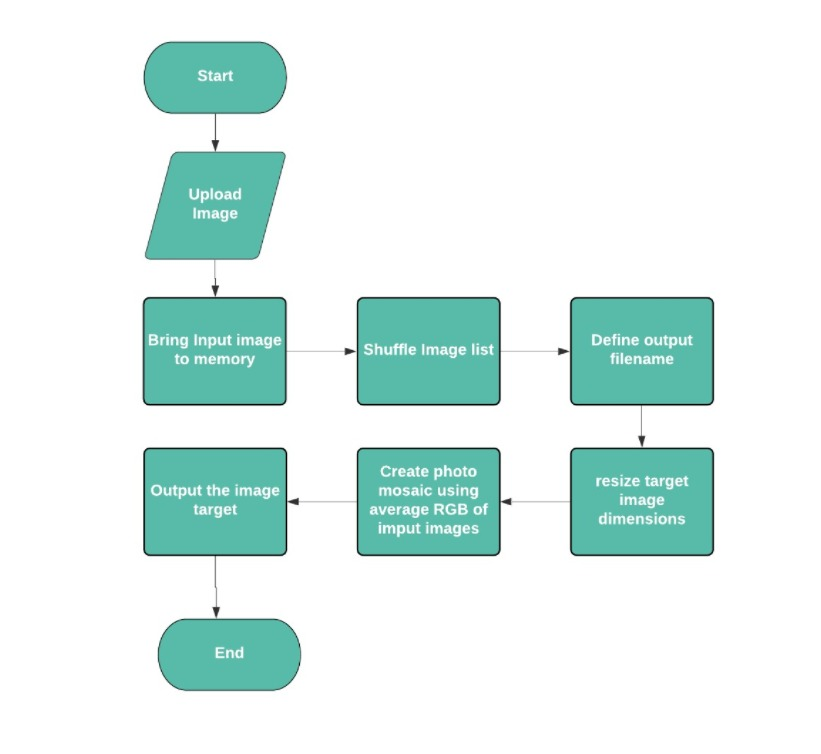

# UCS757:Building Innovative Systems

# Project 3: Mosaic Generator
## Introduction
This project generates the mosaic for a given input image

## Requirements
1. Python
2. Numpy
3. Image
4. Nodejs

## Live Link
https://mosaic-generator-101803157.herokuapp.com/

## Input Interface

## Input

## Output   

## Flowchart

## Submitted by:-
### Srishti Mittal
### 101803157
### COE 8